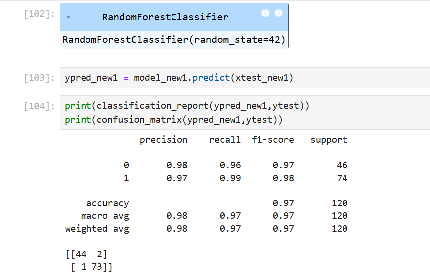

# Chronic-Kidney-Disease
This project focuses on analysing kidney disease patient data using Exploratory Data Analysis (EDA) and Machine Learning techniques to identify important medical indicators associated with CKD prediction.
# Chronic Kidney Disease Prediction

## Introduction
This project focuses on analyzing kidney disease patient data using Exploratory Data Analysis (EDA) and Machine Learning techniques.

## Objectives
- Data preprocessing
- Exploratory Data Analysis
- Feature selection
- Building classification models
- Predicting CKD cases

## Algorithms Used
- Decision Tree
- Random Forest
- Gradient Boosting
- AdaBoost
  

## Confusion Matrix

## Model Performance
- Decision Tree Accuracy: 94%
- Random Forest Accuracy: 97%
- AdaBoost Accuracy: 100%

## Visualizations
- Histograms
- Boxplots
- KDE plots
- Heatmap
- Scatterplots

## Conclusion
Machine learning models successfully classified CKD and non-CKD patients with high accuracy.
